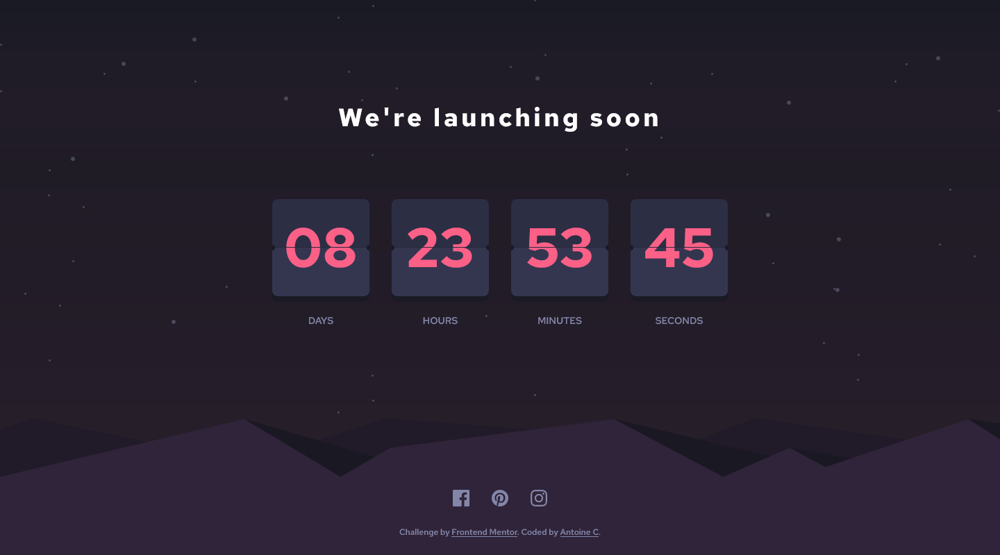
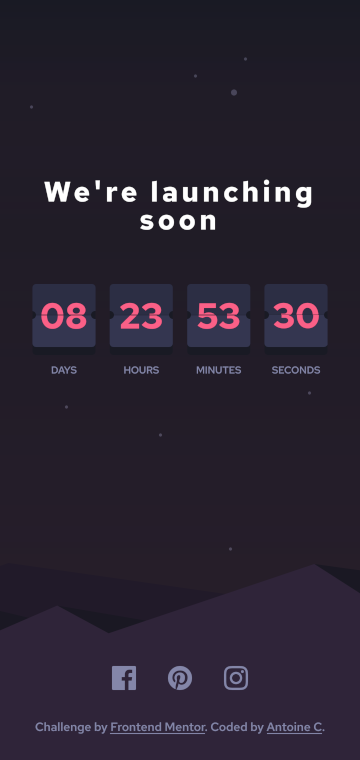

# Frontend Mentor - Launch countdown timer solution w/ bonus (flipping cards)

This is a solution to the [Launch countdown timer challenge on Frontend Mentor](https://www.frontendmentor.io/challenges/launch-countdown-timer-N0XkGfyz-).

## Table of contents

- [Overview](#overview)
  - [The challenge](#the-challenge)
  - [Screenshot](#screenshot)
  - [Links](#links)
- [My process](#my-process)
  - [Built with](#built-with)
  - [What I learned](#what-i-learned)
  - [Useful resources](#useful-resources)
- [Author](#author)

## Overview

### The challenge

Users should be able to:

- See hover states for all interactive elements on the page
- See a live countdown timer that ticks down every second (start the count at 14 days)
- **Bonus**: When a number changes, make the card flip from the middle

### Screenshot





### Links

- Solution URL: [See solution here](https://www.frontendmentor.io/solutions/todo-app-localstorage-lightdark-mode-sveltekit-ts-and-tailwindcss-nL6zrqo54K)
- Live Site URL: [See live site here](https://launch-countdown-timer-pi-three.vercel.app/)

## My process

### Built with

- Semantic HTML5 markup
- Flexbox
- [Typescript](https://www.typescriptlang.org/) - Strongly typed JS

### What I learned

#### Multiple backgrounds

```css
background-image: linear-gradient(
    hsla(235, 16%, 14%, 0.1) 0%,
    hsla(345, 95%, 68%, 0.03) 30%,
    hsla(345, 95%, 68%, 0.075) 100%
  ), url(./bg-stars.svg);
background-repeat: no-repeat, repeat;
background-position: top, center;
background-size: auto, auto;
```

### Useful resources

- [Modern CSS Reset](https://www.joshwcomeau.com/css/custom-css-reset/#the-css-reset) - Simple/Modern CSS Reset where you can add your specifics.

## Author

- Frontend Mentor - [@AntoineC-dev](https://www.frontendmentor.io/profile/AntoineC-dev)
